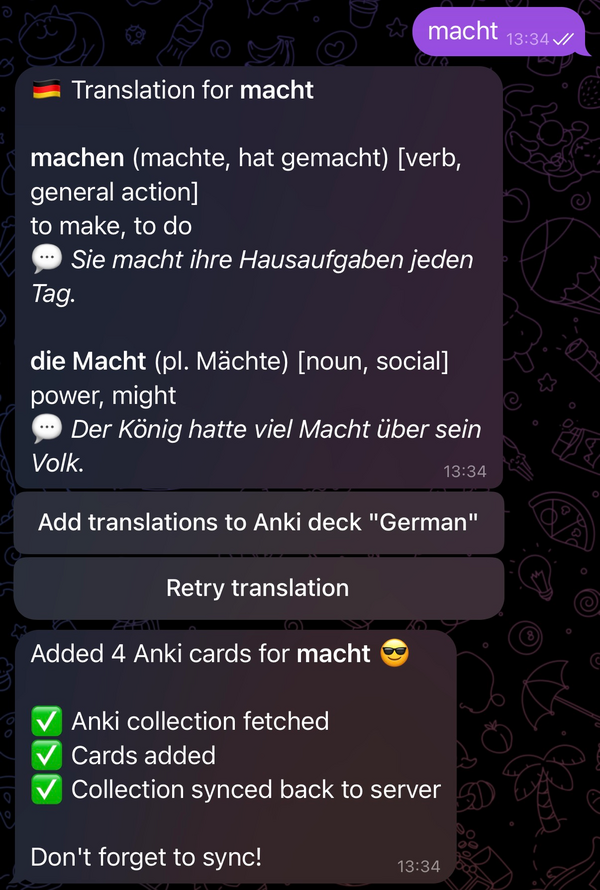
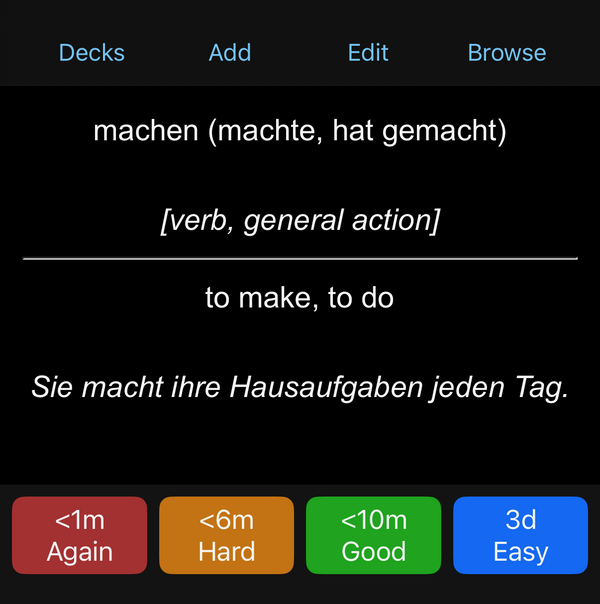

# AnkiBot

A Telegram bot that turns words into Anki flashcards. Send a German word, get AI-powered translations with examples, and add them to your Anki deck with one tap.

<p align="center">
  
  &nbsp;&nbsp;&nbsp;&nbsp;
  
</p>
<p align="center">
  <em>Send a word to the bot → Get a flashcard in Anki</em>
</p>

## Features

- **Smart translations** — Uses OpenAI to find multiple meanings and contexts
- **Grammar included** — Articles (der/die/das), plural forms, verb conjugations
- **Example sentences** — Shows how the word is actually used
- **Two-way cards** — Creates both German→Ukrainian and Ukrainian→German flashcards
- **Direct sync** — Cards go straight to your Anki sync server

Built for German→Ukrainian, but works with any language pair.

## Quick start with Docker

The easiest way to run everything — bot and Anki sync server together:

**1. Create config file**
```bash
cp config.yaml.example config.yaml
# Edit config.yaml with your credentials
```

**2. Start the stack**
```bash
docker compose up -d
```

That's it! The bot is running and the sync server is available at `http://localhost:8088`.

To sync from your phone, use your machine's IP address (e.g., `http://192.168.1.100:8088`).

### Configuration

Edit `config.yaml`:

```yaml
telegram_bot_token: your_token    # from @BotFather
openai_api_key: sk-xxx            # from OpenAI
openai_model: gpt-4.1

source_language: German
target_language: Ukrainian

users:
  123456:                         # your Telegram user ID (from @userinfobot)
    anki_sync_server: http://anki-sync:8088
    anki_user: user
    anki_password: pass
    anki_deck: German
```

Note: Inside Docker, the bot reaches the sync server at `http://anki-sync:8088` (the service name).

### Customizing sync server credentials

Set environment variables before starting:

```bash
ANKI_USER=myuser ANKI_PASSWORD=mypassword docker compose up -d
```

Or add them to a `.env` file:

```
ANKI_USER=myuser
ANKI_PASSWORD=mypassword
```

## Manual setup (without Docker)

If you prefer to run without Docker:

**1. Install dependencies**
```bash
pip install -r requirements.txt
```

**2. Start an Anki sync server** (see [Anki documentation](https://docs.ankiweb.net/sync-server.html))

**3. Create and edit config**
```bash
cp config.yaml.example config.yaml
```

**4. Run the bot**
```bash
python src/main.py
```

## How it works

```
┌─────────────┐     ┌─────────────┐     ┌─────────────┐
│  Telegram   │────▶│   OpenAI    │────▶│    Anki     │
│    Bot      │     │ Translation │     │ Sync Server │
└─────────────┘     └─────────────┘     └─────────────┘
```

**Components:**
- `bot.py` — Telegram bot handling messages and button clicks
- `translation.py` — Prompts OpenAI and parses structured responses
- `openai.py` — OpenAI API wrapper
- `anki_client.py` — Downloads collection, adds cards, syncs back
- `config.py` — Loads settings from YAML

## Usage

1. Send any word or short phrase to the bot
2. Review the translation with meanings and examples
3. Tap **"Add to Anki"** to create flashcards
4. Sync your Anki app to see the new cards

## Requirements

- Docker and Docker Compose (recommended), or Python 3.12+
- OpenAI API key
- Telegram bot token
